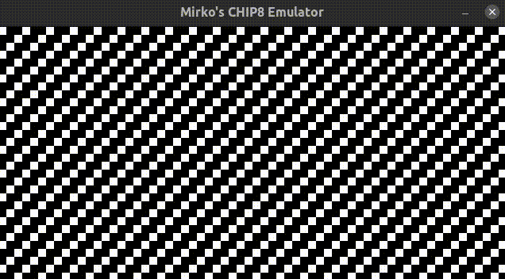
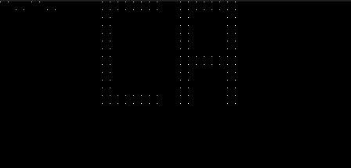

# CHIP8_emulator
CHIP8 emulation project

**Version 2**
---
## GUI - running Tron game

## Terminal - information about the execution


**Version 1**
---



**Usage**
---

```
Usage: ./chip8 [OPTIONS]

  Developed by Mirko Nikic -> (Github: mirkonikic)

Options:
  -h         Help and usage
  -l         List all available roms that can be played
  -r <ROM>   Run specified rom file and play it
  -i <ROM>   Inspect the ROM files size and other details
  -v         Verbose execution, where one can have insight in registers, memory and instructions in other window
  
ALSO you can combine options such as:
  -ri <ROM>   or   -virl <ROM>   or -lh   ...
```

**ToDo**
---
- [x] Preuredi main.h
- [ ] Zapocni execute_args -r -> while loop gde ucita fajl, kreira chip8 objekat i zapocne izvrsavanje
- [ ] dodati prikaz registara, memorije, instrukcija koje se izvrsavaju itd.
- [ ] dodati komande, kvadrat 1-V je keypad, i - stepped instructions on/off, n - next instruction, u $REG - update register/memory cell value, m - mute/unmute
- [ ] audio dodati
- [x] u main-u kreiraj SDL window i render, a onda u display ubaci samo umesto NULL, pa ces lakse korigovati nego da stoji samo u display
- [ ] finish keypad: keypad, pause, exit, reset emulatora, step trough instructions, countinue execution, set register/cell to value, sound on/off
- [ ] fix instructions
- [ ] sredi argumente, -s za speed izvrsavanja u milisekundama, -r za pokretanje programa, -i za informacije o rom fajlu
- [ ] popravi problem kod SpaceInvaders.ch8 i kod Cave.ch8
