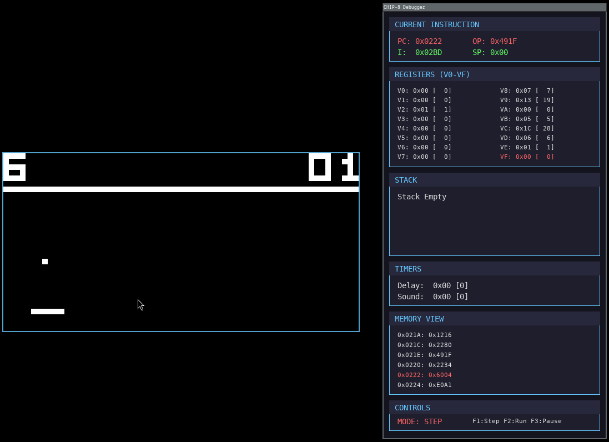

# CHIP8 Debugger 🕹️

[](https://opensource.org/licenses/MIT) 
[](https://github.com/mirkonikic/CHIP8_emulator/issues) 
[](https://github.com/mirkonikic/CHIP8_emulator/stargazers)

A modern **CHIP-8 emulator/debugger** developed by **mirkhoff**, with GUI and terminal output.  
Play classic CHIP-8 games like Tron, Space Invaders, and Cave, or inspect ROMs step-by-step.

---

## Demo

### GUI


### Terminal


---

## Installation 🚀
```bash
git clone https://github.com/mirkonikic/CHIP8_emulator chip8
cd chip8
make
```

---

## Usage
```
Usage: ./chip8 [OPTION]
        -h       : help
        -l       : list
        -r <FILE_NAME>   : run file_name program
        -i <FILE_NAME>   : inspect file_name program
        ALSO you are able to combine commands like:      -ir <FILE_NAME>...
```
